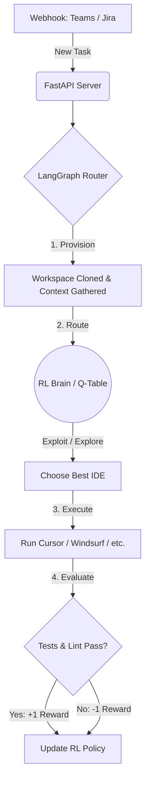

# 🧠 Master Agent Orchestrator (RL_Orchestrator_Ai_SVM)

<div align="center">
  <h3>The AI Tech Lead that autonomously provisions workspaces and routes developer tasks to the best Worker IDEs (Cursor, Windsurf, Claude, VS Code).</h3>
  <br>
</div>

## ✨ Features

- **Multi-IDE Support:** Integrates with local AI code editors (`cursor`, `windsurf`) and API-driven agents (`claude`, `vscode_cline`).
- **Dynamic Provisioning:** Automatically clones repositories and generates a contextual `MEMORIES.md` briefing document so agents have instant situational awareness.
- **Reinforcement Learning (RL):** Utilizes an epsilon-greedy Q-Learning approach to automatically track the success rates of IDEs and route future tasks intelligently.
- **FastAPI Intake:** A lightweight Webhook server to ingest tasks directly from Jira, MS Teams, or GitHub.

---

## 🏗️ Architecture Flow



## 🚀 Getting Started

### 1. Installation

Requires **Python 3.9+**.

```bash
git clone https://github.com/CNirhali/RL_Orchestrator_Ai_SVM.git
cd RL_Orchestrator_Ai_SVM

# Setup virtual environment
python3 -m venv venv
source venv/bin/activate

# Install dependencies
pip install -r requirements.txt
```

### 2. Running the Server

Start the core FastAPI webhook listener:

```bash
python3 main.py
```

The orchestrator will now listen for incoming task assignments on `http://localhost:8000/webhook/task`.

#### Production-like run (recommended)

```bash
python3 -m uvicorn main:app --host 0.0.0.0 --port 8000
```

#### Key configuration (environment variables)

- **`MAO_WORKSPACE_ROOT`**: workspace root directory (default: `/tmp/master_agent_workspaces`)
- **`MAO_RL_STATE_FILE`**: RL state JSON file path (default: `rl_state.json`)
- **`MAO_ENABLE_GIT_CLONE`**: enable `git clone` for http(s) repos (default: `true`)
- **`MAO_SIM_SEED`**: seed for deterministic simulation runs (default: unset / random)
- **`MAO_SIM_SLEEP_S`**: simulated sleep duration (default: `1.0`, set to `0` for tests)

#### Operations endpoints

- **`GET /health`**: liveness
- **`GET /ready`**: readiness (checks workspace + RL state path are writable)
- **`GET /tasks/{task_id}`**: fetch task status/result for accepted tasks

### 4. Dev workflow

```bash
pip install -r requirements.txt -r requirements-dev.txt
python -m ruff check .
python -m pytest -q
```

### 5. LangGraph test-suite planner

Use the built-in LangGraph pipeline to create a best-fit suite from changed files.

```bash
# Plan only
python suite_run.py --changed-path orchestrator/router.py --changed-path main.py

# Plan + execute selected suites
python suite_run.py --changed-path orchestrator/router.py --run
```

The planner returns:
- `risk_level`: `low`, `medium`, or `high`
- `suites`: selected suite tiers (for example `smoke`, `core`, `api_e2e`)
- `commands`: concrete pytest commands chosen by the graph
- `command_results`: per-command outputs when `--run` is provided

### 3. Interactive Web UI Demo

To visualize the Reinforcement Learning routing decisions in real time without external dependencies, open the bundled client-side simulation:

1. Open `index.html` in your browser.
2. Click **"Trigger Developer Task"** to watch the Master Agent dynamically score and evaluate different IDE workers!

---

## 🔍 Execution Preview

Here is an example of the Master Agent routing a task, the Reviewer catching errors, and the RL Brain updating its context scores:

```text
==========================================
       STARTING TASK task-001
       Context Hash: b2d89d11
==========================================
[RL Brain] EXPLORING: chose cursor for context 'b2d89d11'

[Writer Agent] Triggering cursor... (Attempt 1)
[Writer Agent] cursor introduced errors.
[Reviewer Agent] Analyzing changes...
[Reviewer Agent] Changes rejected. Sending back to Writer.

[Writer Agent] Triggering cursor... (Attempt 2)
[Writer Agent] cursor completed the code changes.
[Reviewer Agent] Analyzing changes...
[Reviewer Agent] LGTM! Code is approved.

[RL Brain] Updated Q-value for cursor in context 'b2d89d11': 0.00 -> 0.78
```

---

## 🤖 The RL Brain

The system maintains a lightweight `q_table` for all registered IDEs. Over thousands of runs, if `cursor` successfully compiles code 90% of the time while `windsurf` struggles with your specific stack, the agent will learn to heavily bias `cursor` for future tickets!
